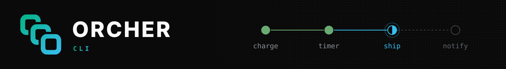

<p>
  <picture>
    <source media="(prefers-color-scheme: dark)" srcset="./assets/banner.svg">
    <source media="(prefers-color-scheme: light)" srcset="./assets/banner-light.svg">
    
  </picture>
</p>

<p align="center"><sub>Start, watch and control ORCHER workflows from your terminal.</sub></p>

<br />

<div>
  <a href="https://github.com/orcher-io/cli/actions/workflows/ci.yml"></a>
  <a href="./LICENSE"></a>
</div>

<br />

`orcher` talks to an ORCHER engine over its gRPC API: list the workflows it is running, look inside one, read its log, and stop it.

-  **Workflows**: list, filter and search executions, and see each one's status, result and pending work
-  **History**: the journal of every step the engine recorded, and the tasks it ran
-  **Logs**: a workflow's log, followed live until it ends
-  **Control**: cancel or terminate a workflow, or send it an event
-  **Scriptable**: `-o json`, `-o yaml` or `-o name` on every command, and exit codes that mean something

<br />

###  Install

Build it from source with a stable Rust toolchain:

```bash
cargo install --git https://github.com/orcher-io/cli
```

> [!NOTE]
> The CLI is pre-1.0: commands and flags may change between minor releases, and each release's notes list what changed.

<br />

###  Quick start

With an engine running on `localhost:50051` (the [quickstart](https://github.com/orcher-io/quickstart) starts one with Docker):

```bash
orcher workflow list                       # recent workflow executions
orcher workflow describe order-1001        # one of them in detail
orcher workflow history order-1001         # every step the engine recorded
orcher logs order-1001 --follow            # its log, until it ends
orcher workflow cancel order-1001          # ask it to stop
```

<br />

###  Commands

| Command | What it does |
|---------|--------------|
| `orcher workflow list` | List executions; filter with `--type` and `--status`, or `--query` |
| `orcher workflow describe <id>` | Status, timing, result or error, and pending tasks, timers and events |
| `orcher workflow history <id>` | The journal: every step the engine recorded |
| `orcher workflow tasks <id>` | The tasks the workflow ran, with attempts and durations |
| `orcher workflow event <id> <name>` | Send an event, with an optional JSON `--payload` |
| `orcher workflow cancel <id>` | Ask a workflow to stop; it can clean up first |
| `orcher workflow terminate <id>` | Stop a workflow at once |
| `orcher logs <id>` | A workflow's log; `--follow` to keep reading until it ends |
| `orcher namespace list` | Namespaces, and `create`, `describe`, `update`, `deprecate`, `delete` |
| `orcher completion <shell>` | Shell completions for bash, zsh, fish, PowerShell and elvish |

Run `orcher <command> --help` for every flag and more examples.

<br />

###  Options

Every command takes these, as a flag or from the environment:

| Flag | Environment | Default | |
|------|-------------|---------|---|
| `--server` | `ORCHER_SERVER` | `http://localhost:50051` | The engine's gRPC address; `https://` uses TLS |
| `-n`, `--namespace` | `ORCHER_NAMESPACE` | `default` | The namespace to act in |
| `--api-key` | `ORCHER_API_KEY` | | For an engine that requires an API key |
| `-o`, `--output` | | `table` | `table`, `json`, `yaml` or `name` |
| `-q`, `--quiet` | | | Print only what was asked for |
| `--no-color` | `NO_COLOR` | | Plain text |

A command that fails prints the reason to stderr and exits with status 1. Commands that would stop or delete something ask first; pass `--yes` to skip the question, as you must when there is no terminal to ask on.

<br />

###  Contributing

Issues and pull requests are welcome. See [CONTRIBUTING.md](CONTRIBUTING.md) for how to build, test and propose a change.

###  License

Licensed under the [Apache License, Version 2.0](LICENSE).
